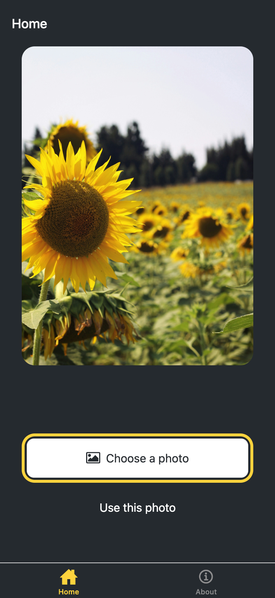

# Welcome to my first Expo app 👋

# wpk25-mobile-app

A mobile app built with React Native and Expo, featuring a modern tab-based navigation and customizable UI components.

## Features

- Tab-based navigation
- Customizable UI components (Button, ImageViewer, etc.)
- File-based routing
- Ready for Android, iOS, and web

## How to create and run this project

### 1. Create the project

To create this project from scratch, use the following command:

```bash
npx create-expo-app@latest wpk25-mobile-app
```

This will scaffold a new Expo app in the `wpk25-mobile-app` directory using the default template.

After the command completes, navigate to the project folder and install dependencies (if not already done):
cd wpk25-mobile-app

```bash
npm install
```

### 2. (Optional) Get a fresh blank app

If you want to start with a blank app, run in one terminal:

```bash
npm run reset-project
```

While this is running, you can start the development server in a separate terminal:

```bash
npx expo start
```

This allows you to reset the project and run the app at the same time.

### 3. Create an Expo account (on your computer)

1. Go to [Expo website](https://expo.dev/signup) and sign up for a free account, or log in if you already have one.
2. You can also log in via the terminal:

   ```bash
   npx expo login
   ```

   Follow the instructions to enter your username and password.

### 4. Install Expo Go on your phone

- For Android: Open the Google Play Store and search for **Expo Go**. Install the app.
- For iOS: Open the App Store and search for **Expo Go**. Install the app.

### 5. Start the development server

In the project folder, run:

```bash
npx expo start
```

This will open a new tab in your browser with a QR code.

### 6. Open the app on your phone

1. Make sure your phone and computer are connected to the same Wi-Fi network.
2. Open the **Expo Go** app on your phone.
3. Sign in with the same Expo account you used on your computer (if prompted).
4. Tap "Scan QR Code" in Expo Go and scan the QR code from your computer screen.
5. The app will load and run on your phone.

> **Tip:** If you have issues scanning the QR code, you can also enter the development server URL manually in Expo Go.

---

## Recent additions

- Project initialized with git and connected to GitHub
- Added README.md with project description
- Set up main branch and remote origin

## Learn more

To learn more about developing your project with Expo, look at the following resources:

- [Expo documentation](https://docs.expo.dev/): Learn fundamentals, or go into advanced topics with our [guides](https://docs.expo.dev/guides).
- [Learn Expo tutorial](https://docs.expo.dev/tutorial/introduction/): Follow a step-by-step tutorial where you'll create a project that runs on Android, iOS, and the web.

## Join the community

---

## Deploying your app

You can deploy your Expo app either as a mobile app (for App Store/Google Play) or as a web/demo version. Here are the main options:

### 1. Deploy to Expo servers (web/demo)

**This option is free.**

This is the easiest way to share your app for testing or demo purposes.

**Steps:**

1. Make sure you are logged in to your Expo account:

   ```bash
   npx expo login
   ```

2. Publish your project:

   ```bash
   npx expo publish
   ```

3. After publishing, you will get a link like:

   https://expo.dev/@your-username/your-project-name

   You can open this link in a browser or in the Expo Go app. To check your published projects, use:

   ```bash
   npx expo whoami
   npx expo url:open --web
   ```

npm install -g eas-cli
eas update

### 1. Deploy to Expo servers (web/demo)

**This option is free.**

This is the easiest way to share your app for testing or demo purposes.

**Steps (2026, updated):**

1. Make sure you are logged in to your Expo account:

   ```bash
   npx expo login
   ```

2. Install EAS CLI (if you haven't already):

   ```bash
   npm install -g eas-cli
   ```

3. Start the publishing process:

   ```bash
   eas update
   ```

   - If the project is not configured, choose **Y** (Yes) to automatically create an EAS project.
   - When prompted for a branch name, enter: `main`
   - When prompted for an update message, enter a short description (e.g.: `README.md is organised`).

4. Wait for the process to finish. You will receive a link to your update, for example:

   [https://expo.dev/accounts/silvana1/projects/wpk25-mobile-app/updates/408bb02c-8444-436b-b519-d1c771c10752](https://expo.dev/accounts/silvana1/projects/wpk25-mobile-app/updates/408bb02c-8444-436b-b519-d1c771c10752)

   You can share this link or open it in a browser/Expo Go.

**Example terminal process:**

```bash
npx expo login
# enter your username and password

npm install -g eas-cli


# choose Y to create an EAS project if needed
# enter main for branch
# enter update message (e.g.: README.md is organised)
```

After a successful deploy, you will see a link to your update, which you can share:

## https://expo.dev/accounts/silvana1/projects/wpk25-mobile-app/updates/408bb02c-8444-436b-b519-d1c771c10752

### 3. Run your app in the browser (web demo)

You can run your Expo app as a web demo locally using the following steps:

**Steps:**

1. In your project folder, run:

   ```bash
   npx expo start --web
   ```

2. This will start the Metro Bundler and open a local web server (usually at http://localhost:8081 or similar).

3. Open the provided URL in your browser to view and test your app as a web application.

4. You will see logs and build progress in the terminal. Press `Ctrl+C` to stop the server when finished.

**Tip:** You can use this for local testing and development. For public web deployment, see Expo's [web deployment guide](https://docs.expo.dev/workflow/deployment/).

### 2. Deploy to App Store / Google Play (EAS Build)

**This option requires paid developer accounts:**

- Apple Developer Program: $99/year
- Google Play Console: $25 one-time fee

EAS Build itself has a free plan (with some limitations), but publishing to the app stores always requires a paid developer account.

This is for publishing your app as a real mobile app.

**Steps:**

1. Install EAS CLI if you haven't already:

   ```bash
   npm install -g eas-cli
   ```

2. Configure EAS for your project:

   ```bash
   eas build:configure
   ```

3. Build your app:
   - For Android:
     ```bash
     eas build --platform android
     ```
   - For iOS:
     ```bash
     eas build --platform ios
     ```

4. Download the build file from the link provided after the build completes.

5. Upload the file to Google Play Console (Android) or App Store Connect (iOS).

For more details, see the [EAS Build documentation](https://docs.expo.dev/build/introduction/).

---

**Note:**

- Deploying to Expo servers (expo publish) is free, very easy, and suitable for demos and testing.
- Deploying to the app stores is more complex and always requires paid developer accounts and certificates, but Expo and EAS make the process much simpler than native development.

Join our community of developers creating universal apps.

- [Expo on GitHub](https://github.com/expo/expo): View our open source platform and contribute.
- [Discord community](https://chat.expo.dev): Chat with Expo users and ask questions.
